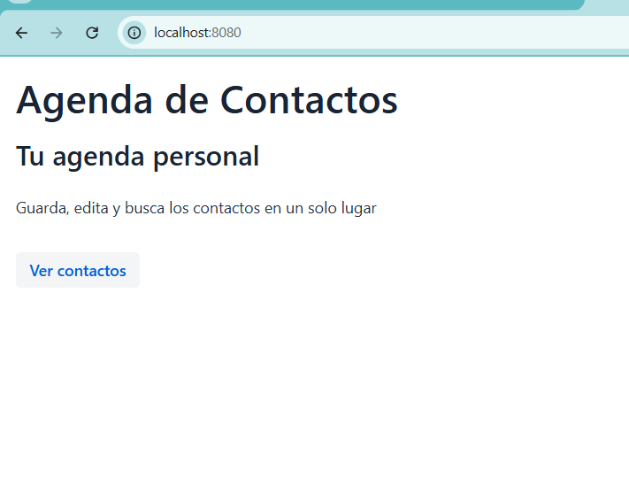
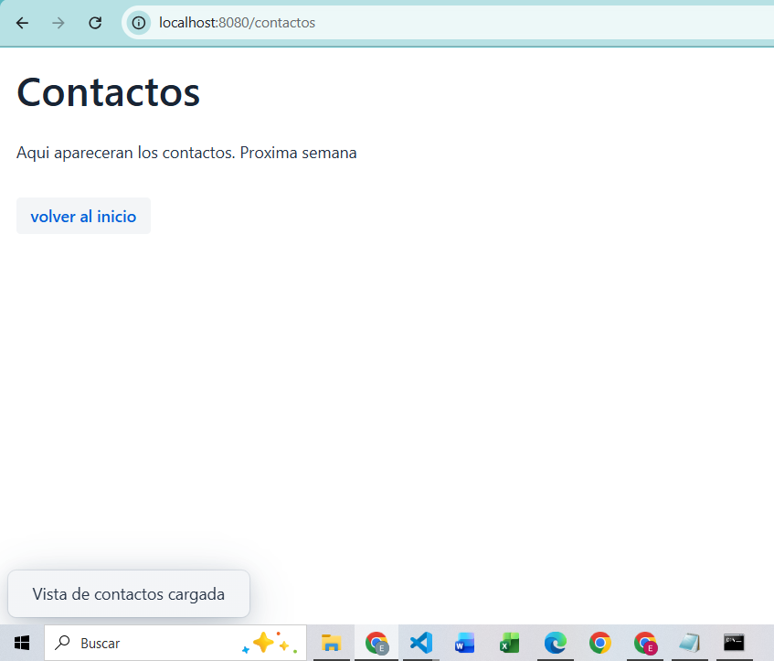

# Semana 7: Vaadin-Primera App Web

Este proyecto consiste en una aplicacion web de gestion de contactos desarrollada con Java, utilizando Spring Boot y Vaadin. Permite visualizar contactos mediante una interfaz web interactiva

## Funcionalidades
- Desplazamiento con Buuton
- Notificacion que desaparece

## Como ejecutar 
1. Entrar a la carpeta `cd semana-07-agenda-web/agenda-web`
2. Correr con `mvn spring-boot:run`
3. Ejecutar en el navegador `localhost:8080`

## Capturas del navegador

