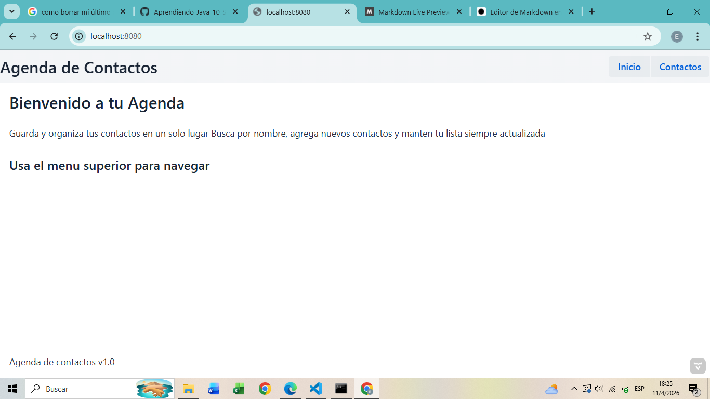
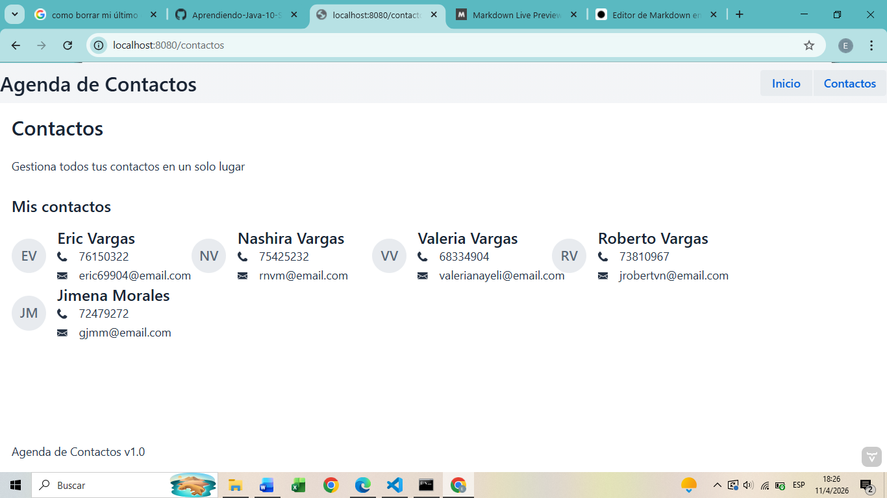

# Semana 8: Vaadin estructura y componenter 

Esta aplicacion web permite gestionar una lista de contactos de manera sencilla
El usuario puede visualizar sus contactos, junto con su informacion basica como nombre, teléfono y correo electronico, organizados en una interfaz clara y estructurada

## Funcionalidades

- **AppLayout**
Define la estructura principal de la aplicacion, incluyendo la barra superior visible en todas las vistas
- **MenuBar**
Permite la navegación entre las vistas de Inicio y Contactos mediante enlaces
- **H2, H3 y Paragraph**
Se utilizan para organizar la jerarquia del texto dentro de las vistas
- **Avatar**
Representa visualmente a cada contacto mediante sus iniciales
- **Icon**
Se utiliza para mostrar iconos junto al teléfono y correo electrónico
- **Div**
Se usa como contenedor para construir la tarjeta de cada contacto

## Como ejecutar 
1. Entrar a la carpeta `cd semana-08-agenda-web/agenda-web`
2. Compilar con `mvn compile`
2. Correr con `mvn spring-boot:run`
3. Ejecutar en el navegador `localhost:8080`

## Capturas del navegador

