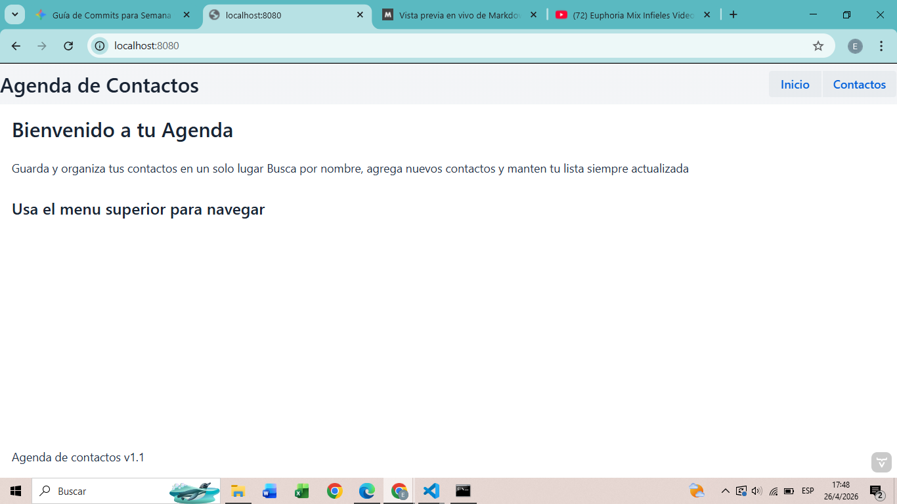
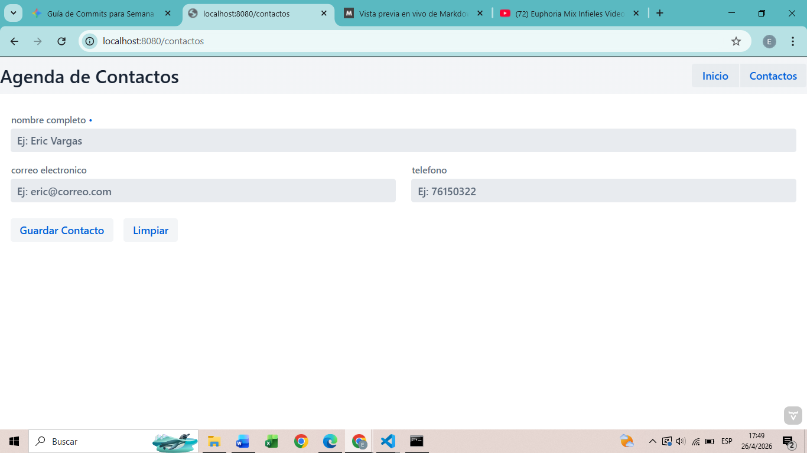

# Semana 9: Vaadin estructura y componenter 

Esta aplicacion web permite gestionar un formulario de contactos de manera sencilla 
El usuario puede ingresar cosas basicas como nombre, teléfono y correo electronico, con ejemplos de como llenar cada espacio del formulario y no permitir el guardado de datos que no cumplen con la sintaxis de cada espacio
Arquitectura por capas y la vinculación de datos mediante el uso de `Binder`

## Funcionalidades

- **ManejadorJSON**
Refactorizado para utilizar métodos de instancia y soportar backups automáticos.

- **ContactoService** 
Anotado con @Service para la inyección de dependencias de Spring. Maneja el filtrado de nombres

## ¿Por qé la vista no toca el JSON directamente?
En esta arquitectura, la vista se comunica exclusivamente con el ContactoService
- La vista no necesita saber cómo se guardan los datos, solo necesita enviarlos
- El servicio actúa como un filtro, asegurando que solo los contactos válidos lleguen al archivo final.

## Como ejecutar 
1. Entrar a la carpeta `cd semana-09-agenda-web/agenda-web`
2. Compilar con `mvn compile`
2. Correr con `mvn spring-boot:run`
3. Ejecutar en el navegador `localhost:8080`

## Diagrama ASCII

```
ContactosView
        |
        v
ContactosService            <- @Service
        |
        v
ManejadorJSON               <- lee/escribe contactos.json
        |
        v
contactos.json
```


## Ejemplo vista JSON
```
[
  {
    "nombre": "eric vargas",
    "telefono": "76150322",
    "email": "eric69904@gmail.com"
  },
  {
    "nombre": "jose felipino",
    "telefono": "61234567",
    "email": "jose@gmail.com"
  }
]
```

## Capturas del navegador


